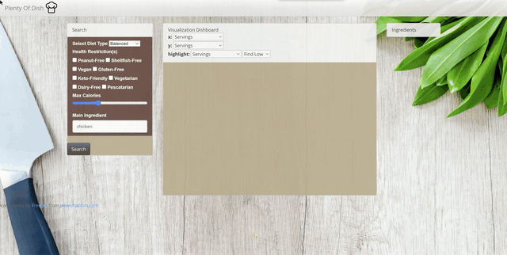

# Plenty of Dish: a recipe dashboard
This project uses the edamam recipe search API to create an interactive dashboard of recipes that shares nutrition information, tailored to the user's search criteria. 
## Data
Data for this dashboard is dynamically pulled from Edamam's API based on user's search criteria.
Link: https://developer.edamam.com/edamam-docs-recipe-api 
## Technology Used
This dashboard uses Python Flask–powered RESTful API, HTML/CSS, JavaScript, and MongoDB. 
The javascript libraries used in the application include d3 and chart.js.
### Folder Structure
Because this application uses Flask, the html files are stored in the templates folder. The css, images, and js files are stored under the static folder. 
## Web-based Dashboard
### Landing Page
The landing page of our web application, Plenty of Dish, includes a search form that allows users to search through Edamam's recipes based on criteria such as diet, health labels, calories, and ingredients. Upon hiting the search button, users will be presented with a scatterplot to assist them with deciding what recipe they want to select (e.g. prep time vs. calories). By clicking on a data point on the scatterplot, the user is then taken to a new page that displays information about their chosen recipe.
### Recipe Page
The recipe page displays the user's chosen recipe based on their selection on the landing page. This page provides information of the recipe, including meal type, cuisine type, and nutrition informaiton such as calories and amount of nutrients (e.g. fat, carbs, protein). There is also a link to the orginal source of the recipe (with full list of ingredients and detailed instructions).  

## Creators
Miguel Flores, Kyle Ledesma, Hannah Wang, Tameka Kuar
